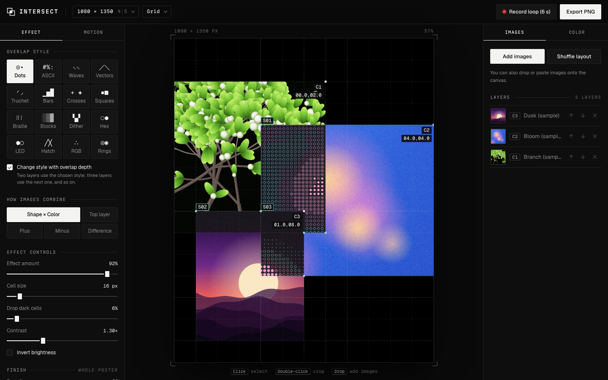

# Intersect

**Where images overlap, a third image appears.**



Intersect is a browser tool for making posters and social visuals. Pick a canvas size, add your images, and move them around the grid. Wherever they overlap, that region is redrawn as something new: dot matrix, ASCII, braille, dithering, hatching and more. The shape comes from one image and the color from the other.

Everything runs in your browser. Images never leave your device, and there's nothing to sign up for.

## What it does

- **16 overlap styles:** Dots, ASCII, Waves, Vectors, Truchet, Bars, Crosses, Squares, Braille, Blocks, Dither, Hex, LED, Hatch, RGB drops and Rings. Areas where three images overlap can switch to the next style automatically.
- **5 ways to combine images:** Shape × Color, Top layer, Plus, Minus and Difference.
- **Color:**
  - Two-tone presets
  - Gradient maps with up to six stops
  - Colors taken from the images
  - A single custom color
- **Motion:** Breathe, Wave, Scan, Drift and Glitch, plus images that hop across the grid.
- **Finish:** scan lines, RGB split, film grain and vignette.
- **Any canvas size:** Instagram post, story, square, landscape, A4/A3 poster, X header or custom.
- **Grid menu in the top bar:**
  - Adjustable grid size with snapping
  - Figma-style grid lines (never exported)
  - Background dots
- **Cropping:** double-click an image to crop it on the canvas. Drag to reposition and scroll to zoom.
- **Export:** PNG at full resolution, or a seamlessly looping video. You can download, copy, or share to WhatsApp and Instagram.

## Layout

- **Left panel:** Effect and Motion (styles, blend modes, effect controls, finish, animation and recording).
- **Center:** the poster.
- **Right panel:** Images and Color (layers, cropping, mark colors, surfaces).
- **Top bar:** canvas size, grid settings, Record loop and Export.

## Keyboard

| Key | Action |
| --- | --- |
| Arrow keys | Nudge the selected image by one grid cell |
| Enter | Start or finish cropping |
| Esc | Finish cropping, deselect, close dialogs |
| Delete / Backspace | Remove the selected image |

## Run it locally

It's a single HTML file with no build step. Open `index.html` in a browser, or serve the folder:

```bash
npx serve .
```

## Deploy

The site is static, so any static host works. On Vercel:

1. Import this repository at [vercel.com/new](https://vercel.com/new).
2. Leave **Framework Preset** on **Other**. There's no build command and no output directory to set.
3. Deploy. Every push to `main` redeploys automatically.

## Project structure

```
index.html          the whole app: markup, styles and script
favicon.svg         browser tab icon (plus favicon-32.png and apple-touch-icon.png)
docs/screenshot.png README screenshot
```
